# Order Processing Workflows

## Overview
This document outlines the complete order processing workflows for the e-commerce watch store, covering all stages from order creation to delivery and post-delivery management.

## 1. Order Creation Workflow

### 1.1 Customer Order Placement
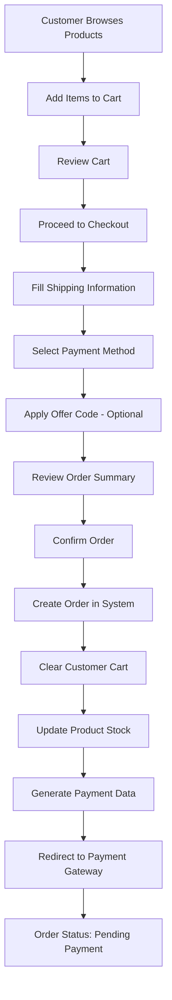

### 1.2 Order Creation Validation
- **Cart Validation**: Ensure cart is not empty
- **Stock Validation**: Verify all products have sufficient stock
- **User Authentication**: Confirm user is logged in
- **Shipping Address**: Validate complete shipping information
- **Payment Method**: Confirm payment method selection

### 1.3 Order Creation Steps
1. **Cart Retrieval**: Get user's current cart
2. **Stock Check**: Verify stock availability for all items
3. **Price Calculation**: Calculate total with any applied offers
4. **Order Creation**: Create order record in database
5. **Stock Update**: Reduce product stock quantities
6. **Cart Clearance**: Clear user's cart
7. **Payment Initiation**: Generate payment gateway data

## 2. Payment Processing Workflow

### 2.1 Payment Flow
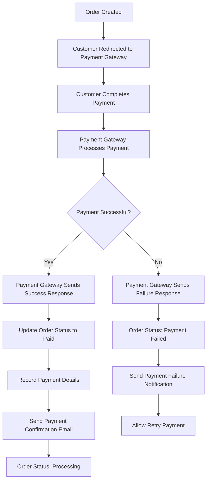

### 2.2 Payment Status Updates
- **Pending Payment**: Initial order state
- **Payment Processing**: Payment gateway processing
- **Payment Successful**: Order marked as paid
- **Payment Failed**: Order remains unpaid, retry allowed

### 2.3 Payment Integration
- **PayFast Integration**: Primary payment gateway
- **Payment Data**: Order ID, amount, customer details
- **Webhook Handling**: Payment status updates
- **Manual Payment Updates**: Admin can mark orders as paid

## 3. Order Processing Workflow

### 3.1 Order Processing Stages
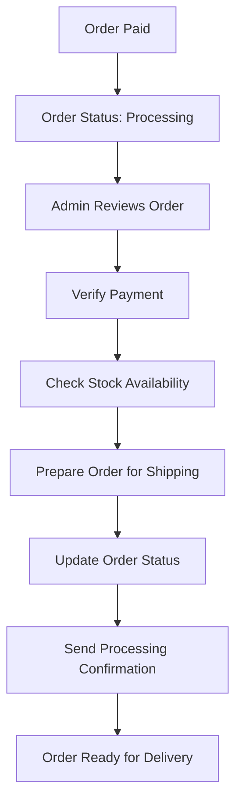

### 3.2 Processing Tasks
1. **Payment Verification**: Confirm payment received
2. **Stock Confirmation**: Double-check stock availability
3. **Order Preparation**: Prepare items for shipping
4. **Shipping Label**: Generate shipping documentation
5. **Status Update**: Update order status to "Processing"

## 4. Shipping and Delivery Workflow

### 4.1 Delivery Process
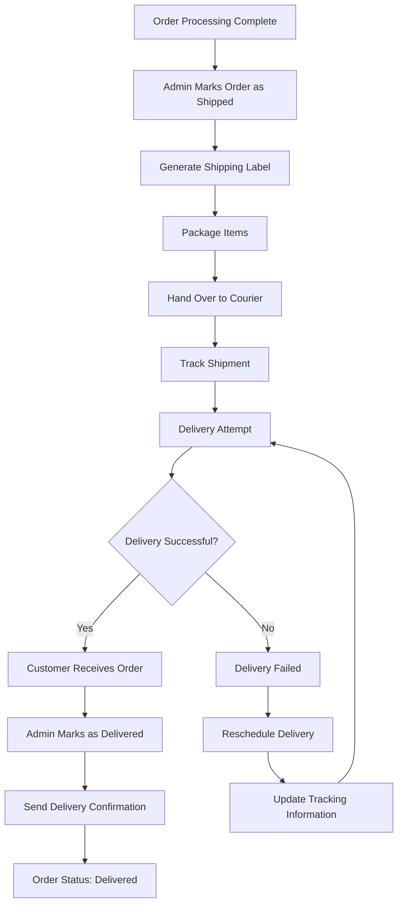

### 4.2 Delivery Status Management
- **Processing**: Order being prepared
- **Shipped**: Order dispatched to courier
- **In Transit**: Order en route to customer
- **Out for Delivery**: Final delivery attempt
- **Delivered**: Order successfully delivered
- **Delivery Failed**: Failed delivery attempt

### 4.3 Delivery Confirmation
1. **Admin Updates Status**: Mark order as delivered
2. **Delivery Date**: Record delivery timestamp
3. **Customer Notification**: Send delivery confirmation
4. **Order Completion**: Order lifecycle complete

## 5. Order Cancellation Workflow

### 5.1 Cancellation Process
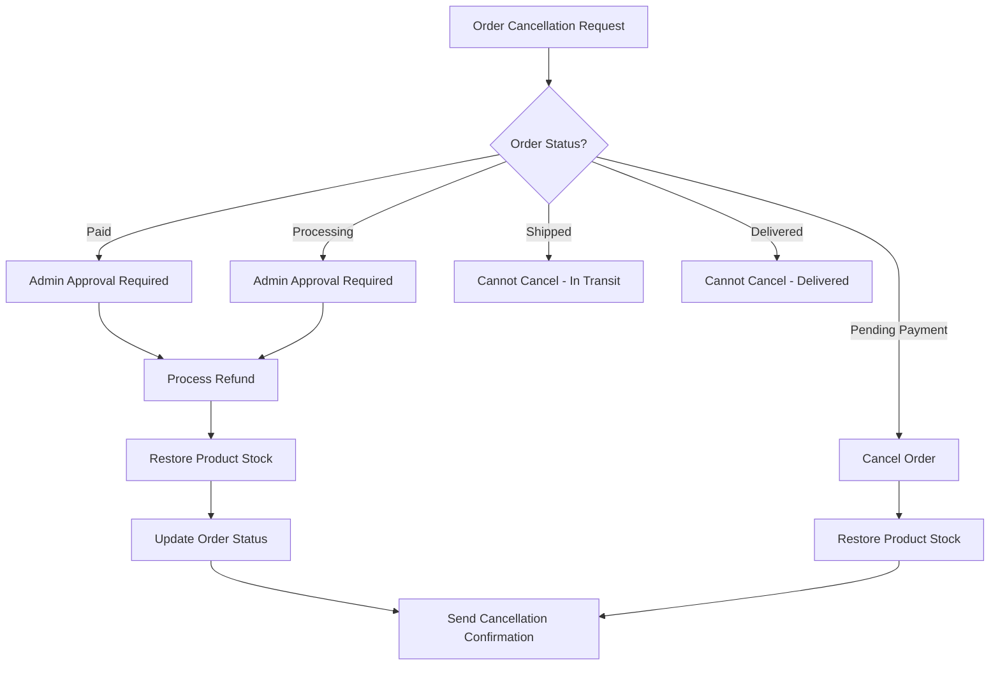

### 5.2 Cancellation Rules
- **Pending Payment**: Can be cancelled immediately
- **Paid Orders**: Require admin approval and refund processing
- **Processing Orders**: Require admin approval
- **Shipped Orders**: Cannot be cancelled (in transit)
- **Delivered Orders**: Cannot be cancelled

### 5.3 Refund Process
1. **Refund Initiation**: Admin initiates refund
2. **Payment Gateway Refund**: Process refund through payment gateway
3. **Stock Restoration**: Restore product stock
4. **Customer Notification**: Send refund confirmation

## 6. Admin Order Management Workflow

### 6.1 Admin Dashboard Overview
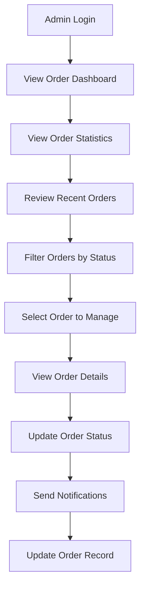

### 6.2 Admin Actions
1. **View Orders**: Access all orders with filtering
2. **Order Details**: View complete order information
3. **Status Updates**: Update order status manually
4. **Customer Communication**: Send order updates
5. **Issue Resolution**: Handle order problems

### 6.3 Order Status Management
- **Mark as Paid**: Update payment status
- **Mark as Processing**: Begin order preparation
- **Mark as Shipped**: Dispatch order
- **Mark as Delivered**: Confirm delivery
- **Cancel Order**: Cancel with refund

## 7. Customer Order Tracking Workflow

### 7.1 Customer Order View
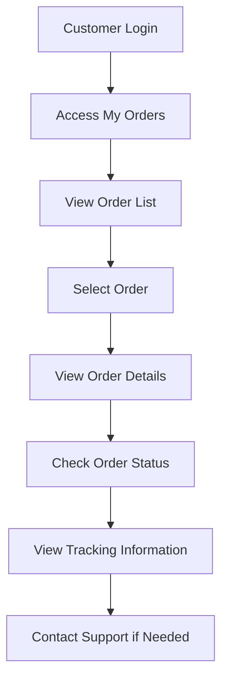

### 7.2 Customer Actions
1. **Order History**: View all past orders
2. **Order Details**: Access complete order information
3. **Status Tracking**: Monitor order progress
4. **Support Contact**: Reach out for assistance

## 8. Order Analytics and Reporting Workflow

### 8.1 Analytics Dashboard
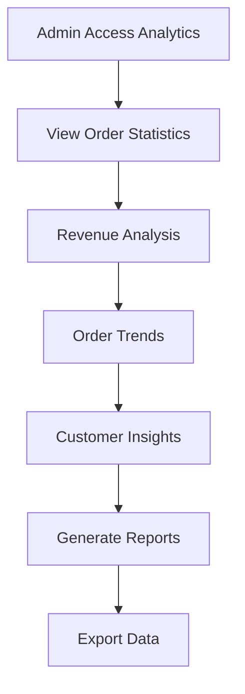

### 8.2 Key Metrics
- **Total Orders**: Complete order count
- **Revenue**: Total sales revenue
- **Order Status Distribution**: Orders by status
- **Monthly Trends**: Order volume trends
- **Customer Behavior**: Order patterns

## 9. Error Handling and Exception Workflows

### 9.1 Payment Failures
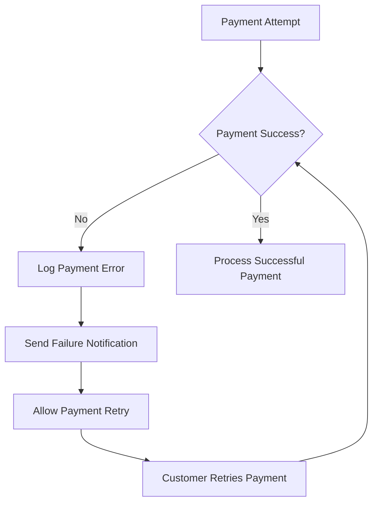

### 9.2 Stock Issues
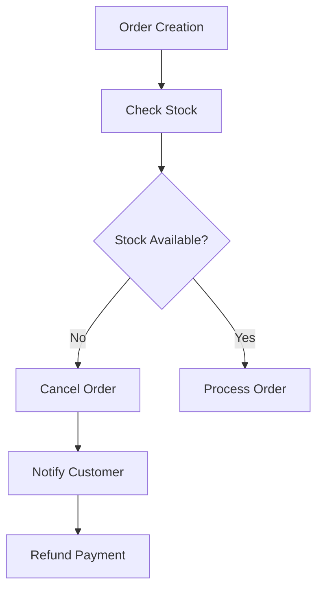

### 9.3 Delivery Issues
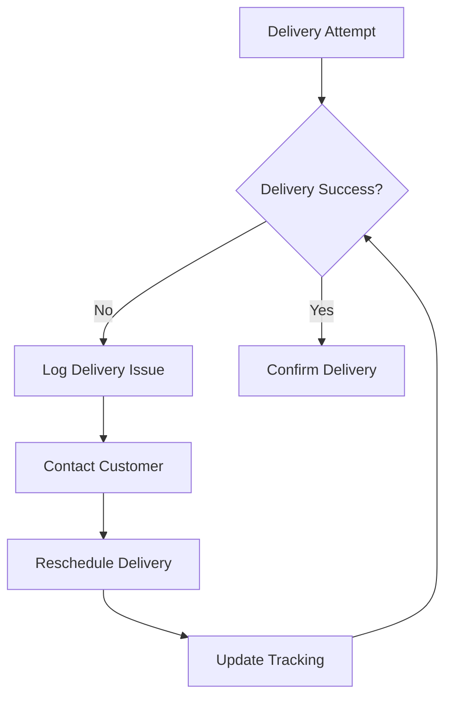

## 10. Notification Workflows

### 10.1 Email Notifications
- **Order Confirmation**: Sent when order is created
- **Payment Confirmation**: Sent when payment is successful
- **Processing Update**: Sent when order processing begins
- **Shipping Notification**: Sent when order is shipped
- **Delivery Confirmation**: Sent when order is delivered
- **Cancellation Notice**: Sent when order is cancelled

### 10.2 Notification Triggers
1. **Order Status Changes**: Automatic notifications
2. **Payment Events**: Payment success/failure notifications
3. **Admin Actions**: Manual notification sending
4. **System Events**: Automated system notifications

## 11. Data Flow and Integration

### 11.1 System Integration Points
- **Cart System**: Order creation from cart
- **Payment Gateway**: Payment processing
- **Inventory System**: Stock management
- **User Management**: Customer information
- **Email System**: Notification delivery

### 11.2 Data Synchronization
- **Real-time Updates**: Live order status updates
- **Database Consistency**: Maintain data integrity
- **Cache Management**: Optimize performance
- **Backup Procedures**: Data protection

## 12. Security and Compliance

### 12.1 Security Measures
- **Authentication**: User login verification
- **Authorization**: Role-based access control
- **Data Encryption**: Sensitive data protection
- **Audit Logging**: Track all order changes

### 12.2 Compliance Requirements
- **Data Protection**: Customer data privacy
- **Payment Security**: PCI DSS compliance
- **Order Records**: Maintain order history
- **Refund Policies**: Clear refund procedures

## 13. Performance Optimization

### 13.1 System Performance
- **Database Optimization**: Efficient queries
- **Caching Strategy**: Reduce load times
- **Pagination**: Handle large datasets
- **Async Processing**: Background tasks

### 13.2 Scalability Considerations
- **Load Balancing**: Distribute system load
- **Database Scaling**: Handle growth
- **CDN Integration**: Fast content delivery
- **Monitoring**: System health tracking

## 14. Testing and Quality Assurance

### 14.1 Testing Scenarios
- **Order Creation**: Test complete order flow
- **Payment Processing**: Test payment scenarios
- **Status Updates**: Test status change flows
- **Error Handling**: Test exception scenarios
- **Admin Functions**: Test admin workflows

### 14.2 Quality Metrics
- **Order Accuracy**: Correct order processing
- **Payment Success Rate**: Payment completion
- **Delivery Success Rate**: Successful deliveries
- **Customer Satisfaction**: Order experience
- **System Uptime**: Service availability

This comprehensive workflow documentation ensures smooth order processing operations and provides clear guidelines for all stakeholders involved in the order management process. 